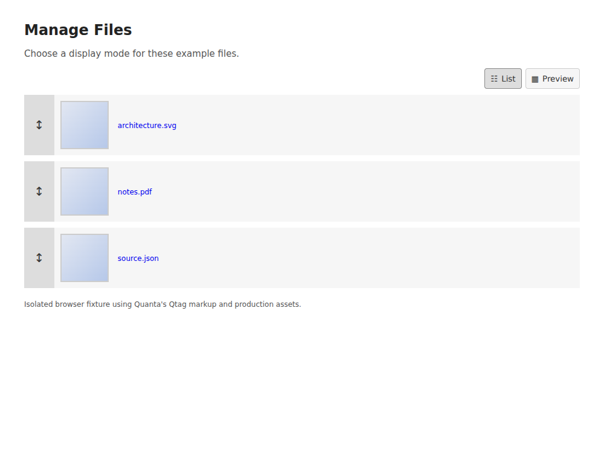
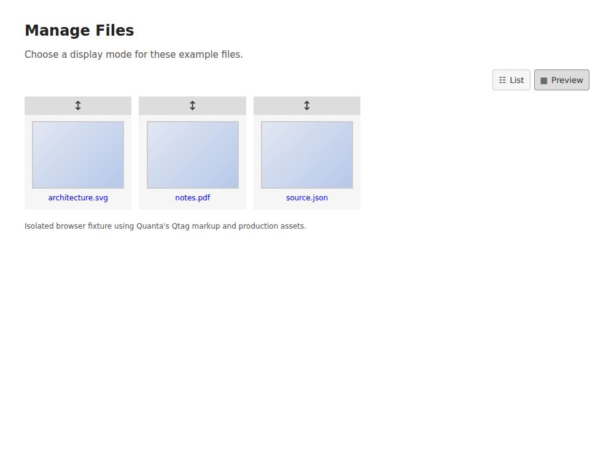
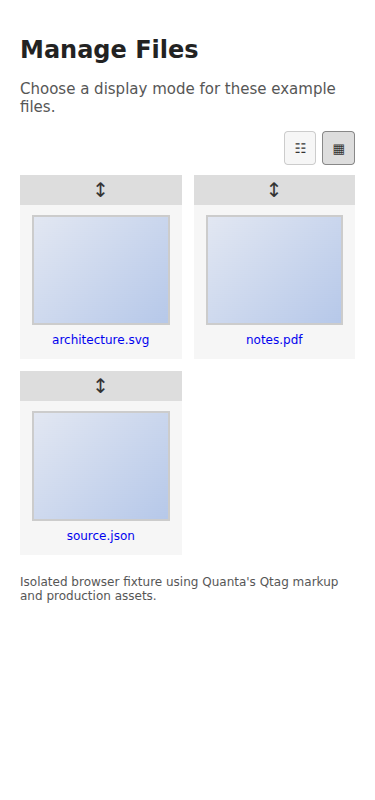

# Manage Files view verification

This submission for #59 adds List and Preview controls to Manage Files. List is
the default, the buttons expose their state with `aria-pressed`, and a stored
choice is restored when opening the page or refreshing the file list.

## Regression fixes

- If localStorage is unavailable or a write fails, retain the newly selected
  mode in memory through Shadow refreshes. Previously, a refresh restored List
  or an older saved choice.
- Wrap long, unbroken filenames within Preview cards. Previously, these names
  escaped their cards and created horizontal overflow at 320px and 375px.

## Results

Compared with the previous submission at
`798d2b34f8d2ba198d42cf88667354b119c0f18b`:

| Suite | Previous submission | With fixes |
| --- | --- | --- |
| Node preference tests | 6 passed, 2 failed | 8 passed, 0 failed |
| Chromium browser tests | 10 passed, 4 failed | 14 passed, 0 failed |

Executed with Node v24.19.0 and Chromium 153.0.8010.0. Browser results are saved
in [before-results.json](file-view-evidence/before-results.json) and
[after-results.json](file-view-evidence/after-results.json).

The browser checks cover the default mode, reload persistence, accessible
controls, Enter and Space activation, Shadow refresh with DOM replacement,
blocked storage, failed writes, invalid saved values, empty lists, multiple
panels, mobile filename wrapping, file order, and real jQuery UI dragging in
both modes.

These checks use an isolated local browser fixture. It loads the production
JavaScript and CSS, the repository's jQuery and jQuery UI, the actual FilesAdmin
button markup, and the actual file row template. Only the preview response is
stubbed. PHP rendering, authentication, upload/delete operations, server-side
ordering persistence, and a running Quanta installation were not exercised.
The Node suite isolates DOM operations while executing the production
preference, click, and refresh handlers.

## Run locally

From the repository root:

```sh
node --test tests/file_view_preference.test.cjs
npm install --no-save --package-lock=false playwright
npx playwright install chromium
QUANTA_BROWSER_EVIDENCE=/tmp/quanta-file-view node tests/file-view-browser.mjs
```

The browser runner also accepts `QUANTA_CHROMIUM_EXECUTABLE` and
`QUANTA_CHROMIUM_ARGS` (a JSON array) for an existing Chromium installation.

To reproduce the previous failures with the same tests:

```sh
git show 798d2b34f8d2ba198d42cf88667354b119c0f18b:src/modules/file/assets/js/file-upload.js > /tmp/quanta-file-upload-before.js
git show 798d2b34f8d2ba198d42cf88667354b119c0f18b:src/modules/file/assets/css/file.css > /tmp/quanta-file-view-before.css
QUANTA_FILE_UPLOAD_SOURCE=/tmp/quanta-file-upload-before.js node --test tests/file_view_preference.test.cjs
QUANTA_FILE_UPLOAD_SOURCE=/tmp/quanta-file-upload-before.js QUANTA_FILE_VIEW_CSS_SOURCE=/tmp/quanta-file-view-before.css QUANTA_BROWSER_EVIDENCE=/tmp/quanta-file-view-before node tests/file-view-browser.mjs
```

## Screenshots

Screenshots show the isolated fixture described above; preview tiles are stub
responses.

List:



Preview:



Mobile (375px):


